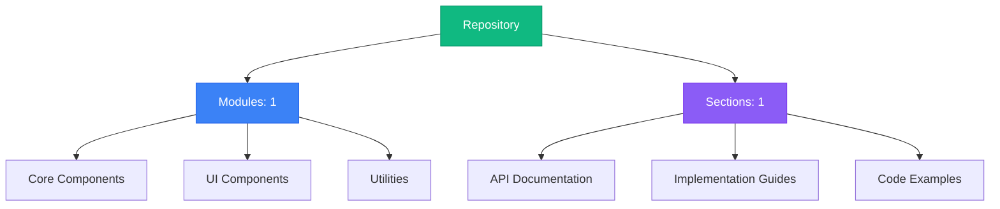
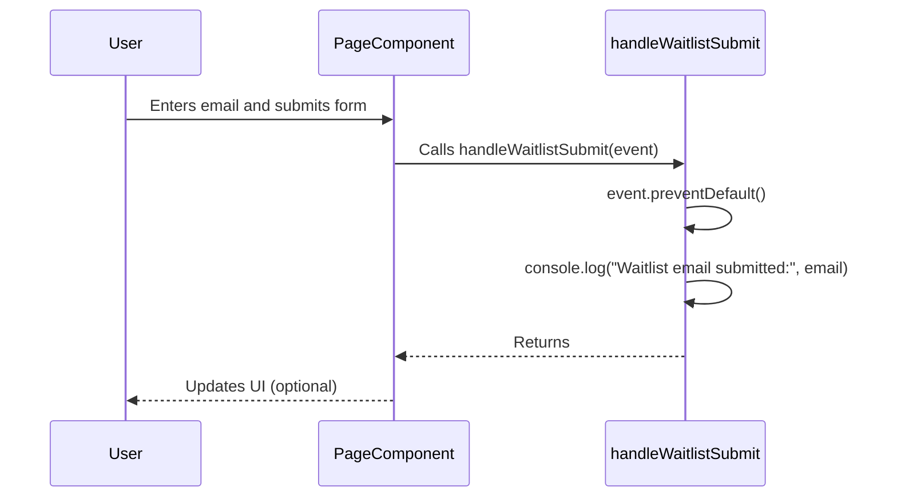

# Repository Documentation 


## Repository Architecture



## Table of Contents

### 1. React Code Snippet Component

No description available

**Sections:**


**1.** Component: Displaying Inline Code Snippets in React UI

---


## Navigation Guide

- **Modules**: Browse through organized code modules in the left sidebar
- **Sections**: Each module contains multiple documentation sections
- **Search**: Use the search bar to quickly find specific content
- **Headings**: Use the right sidebar to navigate within long documents
- **Actions**: Copy or download any section content using the toolbar buttons

## Spay User Application: Architecture and Component Guide

This document provides a comprehensive overview of the Spay user application, detailing its architecture, key components, workflows, and usage. Spay is a secure payment gateway designed for modern application integration, simulating real-world banking operations with a custom-built dummy bank server.

### I. Project Structure and Component Overview

The Spay application is structured into two primary packages: `ui` and `eslint-config`, and an `app` directory within the `user-app`.

*   **`packages/ui`**: Contains reusable UI components.
*   **`packages/eslint-config`**: Houses ESLint configurations for code linting and formatting.
*   **`apps/user-app`**: The main application directory, containing the Next.js application.

#### A. UI Components (`packages/ui/src/utils`)

This package provides reusable UI components used throughout the application.

1.  **`code.tsx`**: Renders inline code snippets.

    ```typescript
    import { type JSX } from "react";

    export function Code({
      children,
      className,
    }: {
      children: React.ReactNode;
      className?: string;
    }): JSX.Element {
      return (
        <code className={`bg-gray-100 rounded-md px-2 py-1 font-mono text-sm ${className}`}>
          {children}
        </code>
      );
    }
    ```

    *   **Purpose**: Displays code snippets within the UI, enhancing readability and presentation.
    *   **Usage**: Used to display code examples or technical terms inline with other text.
    *   **Props**:
        *   `children`: The code snippet to be displayed.
        *   `className`: Optional CSS class names for styling.

2.  **`card.tsx`**: Renders a card component with a title and content.

    ```typescript
    import { type JSX } from "react";

    export function Card({
      className,
      title,
      children,
    }: {
      className?: string;
      title: string;
      children: React.ReactNode;
    }): JSX.Element {
      return (
        <div className={`bg-white rounded-lg shadow-md p-4 ${className}`}>
          <h2 className="text-lg font-semibold mb-2">{title}</h2>
          <div>{children}</div>
        </div>
      );
    }
    ```

    *   **Purpose**: Provides a container for grouping related content, improving UI organization.
    *   **Usage**: Used to display information in a structured and visually appealing manner.
    *   **Props**:
        *   `className`: Optional CSS class names for styling.
        *   `title`: The title of the card.
        *   `children`: The content to be displayed within the card.

3.  **`button.tsx`**: Renders a customizable button component.

    ```typescript
    "use client";

    import { ReactNode } from "react";

    interface ButtonProps {
      children: ReactNode;
      className?: string;
      onclickFunction: () => void;
    }

    export const Button = ({ children, className , onclickFunction}: ButtonProps) => {
      return (
        <button
          className={`bg-blue-500 hover:bg-blue-700 text-white font-bold py-2 px-4 rounded ${className}`}
          onClick={onclickFunction}
        >
          {children}
        </button>
      );
    };
    ```

    *   **Purpose**: Provides a reusable button component with customizable styling and functionality.
    *   **Usage**: Used to trigger actions or navigate to different parts of the application.
    *   **Props**:
        *   `children`: The text or content to be displayed within the button.
        *   `className`: Optional CSS class names for styling.
        *   `onclickFunction`: A function to be executed when the button is clicked.

#### B. ESLint Configurations (`packages/eslint-config`)

This package provides ESLint configurations for maintaining code quality and consistency.

1.  **`base.js`**: Contains the base ESLint configuration shared across all projects.

    ```javascript
    import js from "@eslint/js";
    import eslintConfigPrettier from "eslint-config-prettier";
    import turboPlugin from "eslint-plugin-turbo";
    import tseslint from "typescript-eslint";
    import onlyWarn from "eslint-plugin-only-warn";

    /**
     * A shared ESLint configuration for the repository.
     *
     * @type {import("eslint").Linter.Config[]}
     * */
    export const config = [
      js.configs.recommended,
      eslintConfigPrettier,
      {
        plugins: {
          turbo: turboPlugin,
        },
        rules: {
          "turbo/no-undeclared-env-vars": "warn",
        },
      },
      ...tseslint.configs.recommendedTypeChecked,
      {
        ignores: ["**/dist/**", "**/.turbo/**"],
      },
      {
        files: ["*.ts", "*.tsx", "*.js", "*.jsx"],
        plugins: {
          "@typescript-eslint": tseslint.plugin,
          "only-warn": onlyWarn,
        },
        languageOptions: {
          parserOptions: {
            project: true,
            tsconfigRootDir: __dirname,
          },
        },
        rules: {
          ...onlyWarn.configs.recommended.rules,
          "@typescript-eslint/no-unused-vars": "warn",
          "@typescript-eslint/no-explicit-any": "warn",
          "@typescript-eslint/consistent-type-imports": "warn",
          "@typescript-eslint/no-floating-promises": "warn",
          "@typescript-eslint/no-misused-promises": [
            "error",
            {
              checksVoidReturn: {
                arguments: false,
                attributes: false,
              },
            },
          ],
        },
      },
    ];
    ```

    *   **Purpose**: Defines the base rules and plugins for ESLint, ensuring consistent code style and quality across the repository.
    *   **Key Configurations**:
        *   Extends the recommended JavaScript rules from `@eslint/js`.
        *   Integrates `eslint-config-prettier` to disable ESLint rules that conflict with Prettier.
        *   Uses `eslint-plugin-turbo` for Turbo-specific linting rules.
        *   Applies TypeScript-specific rules from `@typescript-eslint`.

2.  **`react-internal.js`**: Extends the base configuration with React-specific rules.

    ```javascript
    import js from "@eslint/js";
    import eslintConfigPrettier from "eslint-config-prettier";
    import tseslint from "typescript-eslint";
    import pluginReactHooks from "eslint-plugin-react-hooks";
    import pluginReact from "eslint-plugin-react";
    import globals from "globals";
    import { config as baseConfig } from "./base.js";

    /**
     * A custom ESLint configuration for libraries that use React.
     *
     * @type {import("eslint").Linter.Config[]} */
    export const config = [
      ...baseConfig,
      js.configs.recommended,
      {
        plugins: {
          react: pluginReact,
          "react-hooks": pluginReactHooks,
        },
        rules: {
          ...pluginReact.configs.recommended.rules,
          ...pluginReactHooks.configs.recommended.rules,
        },
        languageOptions: {
          globals: {
            ...globals.browser,
            ...globals.node,
          },
          parserOptions: {
            ecmaFeatures: {
              jsx: true,
            },
          },
        },
      },
    ];
    ```

    *   **Purpose**: Adds React-specific linting rules to the base configuration, ensuring best practices for React development.
    *   **Key Configurations**:
        *   Extends the base configuration from `./base.js`.
        *   Integrates `eslint-plugin-react` and `eslint-plugin-react-hooks` for React-specific linting.
        *   Configures global variables for browser and Node.js environments.

3.  **`next.js`**: Extends the base configuration with Next.js-specific rules.

    ```javascript
    import js from "@eslint/js";
    import eslintConfigPrettier from "eslint-config-prettier";
    import tseslint from "typescript-eslint";
    import pluginReactHooks from "eslint-plugin-react-hooks";
    import pluginReact from "eslint-plugin-react";
    import globals from "globals";
    import pluginNext from "@next/eslint-plugin-next";
    import { config as baseConfig } from "./base.js";

    /**
     * A custom ESLint configuration for libraries that use Next.js.
     *
     * @type {import("eslint").Linter.Config[]}
     * */
    export const nextJsConfig = [
      ...baseConfig,
      js.configs.recommended,
      {
        plugins: {
          "@next/next": pluginNext,
        },
        rules: {
          ...pluginNext.configs.recommended.rules,
        },
        languageOptions: {
          globals: {
            ...globals.browser,
            ...globals.node,
          },
          parserOptions: {
            ecmaFeatures: {
              jsx: true,
            },
          },
        },
      },
    ];
    ```

    *   **Purpose**: Adds Next.js-specific linting rules to the base configuration, ensuring best practices for Next.js development.
    *   **Key Configurations**:
        *   Extends the base configuration from `./base.js`.
        *   Integrates `@next/eslint-plugin-next` for Next.js-specific linting.
        *   Configures global variables for browser and Node.js environments.

#### C. Application Components (`apps/user-app/app`)

This directory contains the main application components for the Spay user interface.

1.  **`page.tsx`**: The main landing page component.

    ```typescript
    "use client";
    import { useState, useEffect } from "react";
    import { useRouter } from "next/navigation";
    import { FaDiscord, FaGithub, FaLinkedin, FaYoutube } from "react-icons/fa";
    import { FaXTwitter } from "react-icons/fa6";
    import toast, { Toaster } from "react-hot-toast";

    // Custom SVG Icons
    const ShieldIcon = () => (
      <svg className="w-8 h-8 text-white" fill="none" stroke="currentColor" viewBox="0 0 24 24">
        <path strokeLinecap="round" strokeLinejoin="round" strokeWidth="2" d="M9 12l2 2 4-4m6 2a9 9 0 11-18 0 9 9 0 0118 0z" />
      </svg>
    );

    const CreditCardIcon = () => (
      <svg className="w-8 h-8 text-white" fill="none" stroke="currentColor" viewBox="0 0 24 24">
        <path strokeLinecap="round" strokeLinejoin="round" strokeWidth="2" d="M3 10h18M7 15h1m4 0h1m-7 4h12a3 3 0 003-3V8a3 3 0 00-3-3H6a3 3 0 00-3 3v8a3 3 0 003 3z" />
      </svg>
    );

    const CheckCircleIcon = () => (
      <svg className="w-8 h-8 text-white" fill="none" stroke="currentColor" viewBox="0 0 24 24">
        <path strokeLinecap="round" strokeLinejoin="round" strokeWidth="2" d="M5 13l4 4L19 7" />
      </svg>
    );

    const ArrowRightIcon = () => (
      <svg className="w-5 h-5 ml-3" fill="none" stroke="currentColor" viewBox="0 0 24 24">
        <path strokeLinecap="round" strokeLinejoin="round" strokeWidth="2" d="M9 5l7 7-7 7" />
      </svg>
    );

    export default function SpayLandingPage() {
      const [animateHero, setAnimateHero] = useState(false);
      const [email, setEmail] = useState("");
      const router = useRouter();

      useEffect(() => {
        setAnimateHero(true);
      }, []);

    const handleWaitlistSubmit = (e:any) => {
      e.preventDefault();
      console.log("Waitlist email submitted:", email);
    };

    function Footer() {
      const year = new Date().getFullYear();
      const socialLinks = [
        {
          icon: <FaDiscord className="text-white hover:text-blue-500" size={24} />,
          href: "https://discord.gg/yourdiscord",
        },
        {
          icon: <FaGithub className="text-white hover:text-blue-500" size={24} />,
          href: "https://github.com/yourgithub",
        },
        {
          icon: <FaLinkedin className="text-white hover:text-blue-500" size={24} />,
          href: "https://linkedin.com/yourlinkedin",
        },
        {
          icon: <FaXTwitter className="text-white hover:text-blue-500" size={24} />,
          href: "https://twitter.com/yourtwitter",
        },
        {
          icon: <FaYoutube className="text-white hover:text-blue-500" size={24} />,
          href: "https://youtube.com/youryoutube",
        },
      ];

      return (
        <footer className="bg-gray-800 text-white py-8">
          <div className="container mx-auto text-center">
            <div className="flex justify-center space-x-6 mb-4">
              {socialLinks.map((link, index) => (
                <a key={index} href={link.href} target="_blank" rel="noopener noreferrer">
                  {link.icon}
                </a>
              ))}
            </div>
            <p>&copy; {year} Spay. All rights reserved.</p>
          </div>
        </footer>
      );
    }

      return (
        <div className="bg-gray-900 text-white font-sans antialiased">
          <Toaster position="top-right" reverseOrder={false} />
          <header className="bg-gray-800 py-6">
            <div className="container mx-auto flex items-center justify-between">
              <div className="text-2xl font-bold">
                Spay
              </div>
              <nav>
                <ul className="flex space-x-6">
                  <li>
                    <a href="#features" className="hover:text-blue-500">
                      Features
                    </a>
                  </li>
                  <li>
                    <a href="#pricing" className="hover:text-blue-500">
                      Pricing
                    </a>
                  </li>
                  <li>
                    <a href="#contact" className="hover:text-blue-500">
                      Contact
                    </a>
                  </li>
                </ul>
              </nav>
            </div>
          </header>

          <section className="hero py-20">
            <div className="container mx-auto text-center">
              <h1 className={`text-5xl font-bold mb-6 ${animateHero ? "animate-fade-in" : ""}`}>
                Secure Payment Gateway for Modern Apps
              </h1>
              <p className={`text-lg mb-12 ${animateHero ? "animate-fade-in delay-200" : ""}`}>
                Seamlessly integrate secure payments into your application with Spay.
              </p>
              <form onSubmit={handleWaitlistSubmit} className="max-w-md mx-auto">
                <div className="flex items-center">
                  <input
                    type="email"
                    placeholder="Enter your email"
                    className="bg-gray-700 text-white placeholder-gray-500 rounded-l-md py-3 px-4 focus:outline-none focus:ring-2 focus:ring-blue-500 flex-grow"
                    value={email}
                    onChange={(e) => setEmail(e.target.value)}
                    required
                  />
                  <button
                    type="submit"
                    className="bg-blue-500 hover:bg-blue-700 text-white font-bold py-3 px-6 rounded-r-md focus:outline-none focus:ring-2 focus:ring-blue-500"
                  >
                    Join Waitlist
                  </button>
                </div>
              </form>
            </div>
          </section>

          <section id="features" className="features bg-gray-800 py-16">
            <div className="container mx-auto">
              <h2 className="text-3xl font-bold text-center mb-12">
                Key Features
              </h2>
              <div className="grid grid-cols-1 md:grid-cols-3 gap-8">
                <div className="feature-item text-center">
                  <ShieldIcon />
                  <h3 className="text-xl font-semibold mt-4 mb-2">
                    Secure Transactions
                  </h3>
                  <p className="text-gray-400">
                    Protect your users with our advanced security measures.
                  </p>
                </div>
                <div className="feature-item text-center">
                  <CreditCardIcon />
                  <h3 className="text-xl font-semibold mt-4 mb-2">
                    Easy Integration
                  </h3>
                  <p className="text-gray-400">
                    Integrate Spay with just a few lines of code.
                  </p>
                </div>
                <div className="feature-item text-center">
                  <CheckCircleIcon />
                  <h3 className="text-xl font-semibold mt-4 mb-2">
                    Reliable Performance
                  </h3>
                  <p className="text-gray-400">
                    Enjoy seamless and reliable payment processing.
                  </p>
                </div>
              </div>
            </div>
          </section>

          <section id="pricing" className="pricing py-16">
            <div className="container mx-auto">
              <h2 className="text-3xl font-bold text-center mb-12 text-gray-900">
                Pricing Plans
              </h2>
              <div className="grid grid-cols-1 md:grid-cols-3 gap-8">
                <div className="pricing-plan bg-white rounded-lg shadow-md p-8">
                  <h3 className="text-2xl font-semibold mb-4 text-gray-900">
                    Basic
                  </h3>
                  <div className="text-5xl font-bold mb-4 text-gray-900">
                    Free
                  </div>
                  <p className="text-gray-600 mb-6">
                    Perfect for small projects and personal use.
                  </p>
                  <ul className="mb-6">
                    <li className="flex items-center mb-2">
                      <ArrowRightIcon />
                      <span className="ml-2">
                        Up to 100 transactions per month
                      </span>
                    </li>
                    <li className="flex items-center mb-2">
                      <ArrowRightIcon />
                      <span className="ml-2">
                        Basic support
                      </span>
                    </li>
                  </ul>
                  <button className="bg-blue-500 hover:bg-blue-700 text-white font-bold py-3 px-6 rounded-md w-full">
                    Get Started
                  </button>
                </div>
                <div className="pricing-plan bg-white rounded-lg shadow-md p-8">
                  <h3 className="text-2xl font-semibold mb-4 text-gray-900">
                    Standard
                  </h3>
                  <div className="text-5xl font-bold mb-4 text-gray-900">
                    $29
                    <span className="text-lg">
                      /month
                    </span>
                  </div>
                  <p className="text-gray-600 mb-6">
                    For growing businesses that need more transactions.
                  </p>
                  <ul className="mb-6">
                    <li className="flex items-center mb-2">
                      <ArrowRightIcon />
                      <span className="ml-2">
                        Up to 1000 transactions per month
                      </span>
                    </li>
                    <li className="flex items-center mb-2">
                      <ArrowRightIcon />
                      <span className="ml-2">
                        Priority support
                      </span>
                    </li>
                  </ul>
                  <button className="bg-blue-500 hover:bg-blue-700 text-white font-bold py-3 px-6 rounded-md w-full">
                    Get Started
                  </button>
                </div>
                <div className="pricing-plan bg-white rounded-lg shadow-md p-8">
                  <h3 className="text-2xl font-semibold mb-4 text-gray-900">
                    Premium
                  </h3>
                  <div className="text-5xl font-bold mb-4 text-gray-900">
                    $99
                    <span className="text-lg">
                      /month
                    </span>
                  </div>
                  <p className="text-gray-600 mb-6">
                    For large enterprises with high transaction volumes.
                  </p>
                  <ul className="mb-6">
                    <li className="flex items-center mb-2">
                      <ArrowRightIcon />
                      <span className="ml-2">
                        Unlimited transactions
                      </span>
                    </li>
                    <li className="flex items-center mb-2">
                      <ArrowRightIcon />
                      <span className="ml-2">
                        24/7 support
                      </span>
                    </li>
                  </ul>
                  <button className="bg-blue-500 hover:bg-blue-700 text-white font-bold py-3 px-6 rounded-md w-full">
                    Get Started
                  </button>
                </div>
              </div>
            </div>
          </section>

          <section id="contact" className="contact bg-gray-800 py-16">
            <div className="container mx-auto">
              <h2 className="text-3xl font-bold text-center mb-12">
                Contact Us
              </h2>
              <div className="max-w-md mx-auto">
                <form className="space-y-6">
                  <div>
                    <label htmlFor="name" className="block text-gray-300 mb-2">
                      Name
                    </label>
                    <input
                      type="text"
                      id="name"
                      className="bg-gray-700 text-white placeholder-gray-500 rounded-md py-3 px-4 w-full focus:outline-none focus:ring-2 focus:ring-blue-500"
                      placeholder="Your Name"
                    />
                  </div>
                  <div>
                    <label htmlFor="email" className="block text-gray-300 mb-2">
                      Email
                    </label>
                    <input
                      type="email"
                      id="email"
                      className="bg-gray-700 text-white placeholder-gray-500 rounded-md py-3 px-4 w-full focus:outline-none focus:ring-2 focus:ring-blue-500"
                      placeholder="Your Email"
                    />
                  </div>
                  <div>
                    <label htmlFor="message" className="block text-gray-300 mb-2">
                      Message
                    </label>
                    <textarea
                      id="message"
                      rows={4}
                      className="bg-gray-700 text-white placeholder-gray-500 rounded-md py-3 px-4 w-full focus:outline-none focus:ring-2 focus:ring-blue-500"
                      placeholder="Your Message"
                    />
                  </div>
                  <button
                    type="submit"
                    className="bg-blue-500 hover:bg-blue-700 text-white font-bold py-3 px-6 rounded-md w-full focus:outline-none focus:ring-2 focus:ring-blue-500"
                  >
                    Send Message
                  </button>
                </form>
              </div>
            </div>
          </section>

          <Footer />
        </div>
      );
    }
    ```

    *   **Purpose**: Serves as the main landing page for the Spay application, providing information about the service and a waitlist signup form.
    *   **Key Features**:
        *   Hero section with animated text.
        *   Waitlist signup form.
        *   Features section highlighting key benefits.
        *   Pricing plans section.
        *   Contact form.
        *   Footer with social media links.
    *   **State Management**:
        *   `animateHero`: Controls the animation of the hero section.
        *   `email`: Stores the email address entered in the waitlist form.

2.  **`layout.tsx`**: Defines the root layout for the application.

    ```typescript
    import type { Metadata } from "next";
    import "./globals.css";
    import { Providers } from "./Providers";
    export const metadata: Metadata = {
      title: "Spay - Secure Payment Gateway",
      description: "Spay is a secure and seamless payment gateway powered by a custom-built dummy bank server, simulating real-world banking for modern app integration.",
    };

    export default function RootLayout({
      children,
    }: Readonly<{
      children: React.ReactNode;
    }>) {
      return (
        <html lang="en">
          <body>
            <Providers>
              {children}
            </Providers>
          </body>
        </html>
      );
    }
    ```

    *   **Purpose**: Sets up the basic structure of the application, including metadata and the `Providers` component.
    *   **Key Features**:
        *   Defines the `title` and `description` metadata for the application.
        *   Wraps the `children` with the `Providers` component, enabling NextAuth.js session management.

3.  **`Providers.tsx`**: Provides session management using NextAuth.js.

    ```typescript
    "use client"

    import { SessionProvider } from "next-auth/react"
    import type { ReactNode } from "react"

    interface ProvidersProps {
      children: ReactNode
    }

    export function Providers({ children }: ProvidersProps) {
      return <SessionProvider>{children}</SessionProvider>
    }
    ```

    *   **Purpose**: Wraps the application with the `SessionProvider` from `next-auth/react`, enabling session management and authentication.
    *   **Usage**: Ensures that the application can access and manage user sessions.

### II. Component Interaction and Data Flow

#### A. UI Component Usage

The UI components defined in `packages/ui/src/utils` are used within the `apps/user-app/app/page.tsx` component to construct the user interface.

*   The `Code` component is used to display inline code snippets within the documentation or help text.
*   The `Card` component is used to group related content, such as features or pricing plans.
*   The `Button` component is used to create interactive buttons for actions like joining the waitlist or selecting a pricing plan.

#### B. ESLint Configuration Application

The ESLint configurations defined in `packages/eslint-config` are applied to the entire project to ensure code quality and consistency.

*   The `base.js` configuration provides the foundation for all ESLint rules.
*   The `react-internal.js` configuration extends the base configuration with React-specific rules.
*   The `next.js` configuration extends the base configuration with Next.js-specific rules.

These configurations are typically specified in the project's `.eslintrc.js` file.

#### C. Data Flow in `page.tsx`

The `page.tsx` component manages the state of the landing page and handles user interactions.

1.  **Initial Load**:
    *   The `useEffect` hook is used to set the `animateHero` state to `true` when the component mounts, triggering the hero section animation.
2.  **Waitlist Submission**:
    *   The `handleWaitlistSubmit` function is called when the user submits the waitlist form.
    *   The function prevents the default form submission behavior and logs the email address to the console.
    *   In a real-world application, this function would typically send the email address to a backend server for processing.



**Explanation:**

1.  The user interacts with the `PageComponent` (the landing page), entering their email and submitting the form.
2.  The `PageComponent` calls the `handleWaitlistSubmit` function, passing the event object.
3.  `handleWaitlistSubmit` prevents the default form submission behavior.
4.  `handleWaitlistSubmit` logs the email to the console (this would be replaced with an API call in a real application).
5.  `handleWaitlistSubmit` returns, and the `PageComponent` may optionally update the UI (e.g., display a success message).

### III. Development and Usage

#### A. Setting up the Development Environment

1.  **Install Dependencies**:
    Run `npm install` or `yarn install` in the root directory to install all project dependencies.
2.  **Configure ESLint**:
    Ensure that the `.eslintrc.js` file is properly configured to use the ESLint configurations from `packages/eslint-config`.
3.  **Run the Application**:
    Run `npm run dev` or `yarn dev` in the `apps/user-app` directory to start the development server.

#### B. Using UI Components

To use the UI components in your application, import them from the `packages/ui` package.

```typescript
import { Code, Card, Button } from "@spay/ui";

function MyComponent() {
  return (
    <div>
      <Card title="Example Card">
        <p>This is an example of a card component.</p>
        <Code>console.log("Hello, world!");</Code>
        <Button onclickFunction={() => alert("Button clicked!")}>Click Me</Button>
      </Card>
    </div>
  );
}
```

#### C. Customizing ESLint Configurations

To customize the ESLint configurations, modify the files in the `packages/eslint-config` directory.  Be sure to understand the implications of changing linting rules.  Incorrect configurations can lead to false positives or masking of real issues.

### IV. Advanced Configuration and Customization

#### A. Theming

The UI components can be themed by modifying the CSS class names applied to them. You can use CSS modules, styled components, or any other CSS-in-JS library to customize the appearance of the components.

#### B. Extending ESLint Configurations

You can extend the existing ESLint configurations by creating new configuration files that inherit from the base configurations. This allows you to add project-specific linting rules without modifying the shared configurations.

### V. Performance Considerations and Optimization Strategies

#### A. Code Splitting

Use code splitting to reduce the initial load time of the application. Next.js automatically performs code splitting based on routes, but you can also manually split code using dynamic imports.

#### B. Image Optimization

Optimize images to reduce their file size and improve loading performance. Use tools like `next/image` to automatically optimize images.

#### C. Memoization

Use memoization techniques to avoid unnecessary re-renders of components. React provides the `memo` higher-order component for memoizing functional components.

### VI. Security Implications and Best Practices

#### A. Input Validation

Validate all user inputs to prevent security vulnerabilities such as cross-site scripting (XSS) and SQL injection.

#### B. Authentication and Authorization

Implement proper authentication and authorization mechanisms to protect sensitive data and prevent unauthorized access. Use NextAuth.js for authentication and role-based access control for authorization.

#### C. Data Encryption

Encrypt sensitive data both in transit and at rest to protect it from unauthorized access. Use HTTPS for secure communication and encrypt data stored in databases.

### VII. Common Issues and Troubleshooting

#### A. ESLint Errors

If you encounter ESLint errors, review the ESLint configuration files and the code that is causing the errors. Ensure that the code follows the linting rules and best practices.

#### B. UI Component Rendering Issues

If you encounter issues with UI component rendering, check the component's props and state to ensure that they are properly configured. Use the React Developer Tools to inspect the component tree and identify any rendering issues.

#### C. Performance Issues

If you encounter performance issues, use the browser's developer tools to profile the application and identify performance bottlenecks. Optimize the code and assets to improve performance.

This documentation provides a comprehensive overview of the Spay user application, covering its architecture, key components, workflows, and usage. By following the guidelines and best practices outlined in this document, developers can effectively understand, develop, and maintain the Spay application.
